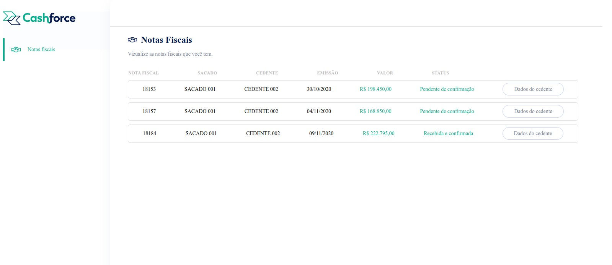

<h1 align="center">
   NF-CRUD-Fullstack
</h1>

<p align="center">
 <a href="#-sobre-o-projeto">Sobre</a> •
 <a href="#-como-executar-o-projeto">Como executar</a> • 
 <a href="#-tecnologias">Tecnologias</a> • 
 <a href="#-endpoints">BackEnd(EndPoints)</a> 
</p>


## 💻 Sobre o projeto

Nesse projeto o objetivo foi desenvolver uma pagina frontend e mostrar todas as notas fiscais do usuario, disponibilizado pelo backend acessando o DB.
No frontend foi utilizado o Vue, e no backend Typescript:


Imagem de como ficou a página finalizada:




## 🚀 Como executar o projeto

Clonar o repositorio.

<details>
<summary><strong>Rodando localmente:</strong></summary><br />

<strong>BackEnd(Porta 3001)</strong>
   
  - Entrar na pasta server

  - Criar um arquivo .env na raiz do projeto(passar as variaveis de ambiente especificadas em .env.example)

    Executar os comandos:

    - npm install

    - npm run start
    
    Caso Banco não esteja criado e alimentado pode utilizar o comando:
    - npm run prestart(Fara a criação do banco de dados,migrations e alimentação do banco)
    
<strong>FrontEnd(Porta 8080)</strong>

   - Entrar na pasta client

   Executar os comandos:

    - npm install

    - npm run start

</details>

<details>
<summary><strong>Rodando pelo Docker-compose:</strong></summary><br />
   Na pasta raiz executar o comando:
   
    - docker-compose up

   Nesse momento tanto o front quanto o back devem estar rodando normalmente
   Caso não ocorra de os seguintes comandos:

    - docker exec -it app_server bash

    - npm install

    - npm run start

    Abra outro terminal e de os comandos:
   
    - docker exec -it app_client bash

    - npm install

    - npm run start

</details>

A aplicação será aberta na porta:8080 - acesse http://localhost:8080


## 🛠 Tecnologias

As seguintes ferramentas foram usadas na construção do projeto:

<details>
<summary><strong>Backend</strong></summary><br />

-   **[TypeScript]**
-   **[Node.js]**
-   **[Sequelize]**
-   **[EsLint]**
-   **[Express]**
-   **[MySQL]**
-   **[CORS]**
-   **[JEST]**
-   **[CHAI]**
-   **[SINON]**
-   **[HELMET]**
</details>

<details>
<summary><strong>Frontend</strong></summary><br />

-   **[Vue]**
-   **[Vue Router]**
-   **[EsLint]**
-   **[Axios]**
-   **[Bootstrap]**
</details>
---

## 🛠 Endpoints

<details>
<summary><strong>User</strong></summary><br />
   
- O endpoint acessível através do caminho GET(`/user/nfs`).


- A rota retorna os dados necessarios para preenchimento da Nota Fiscal:
   
```json
   
{
  orderNfId: string,
  nNf: string,
  orderNumber: string,
  emissionDate: string,
  value: string,
  orderStatusBuyer: string,
  buyer: {
    name: string,
    tradingName: string
  },
  provider: {
    name: string,
    tradingName: string,
    responsibleEmail: string,
    phoneNumber: string
  }
}

```
</details>


